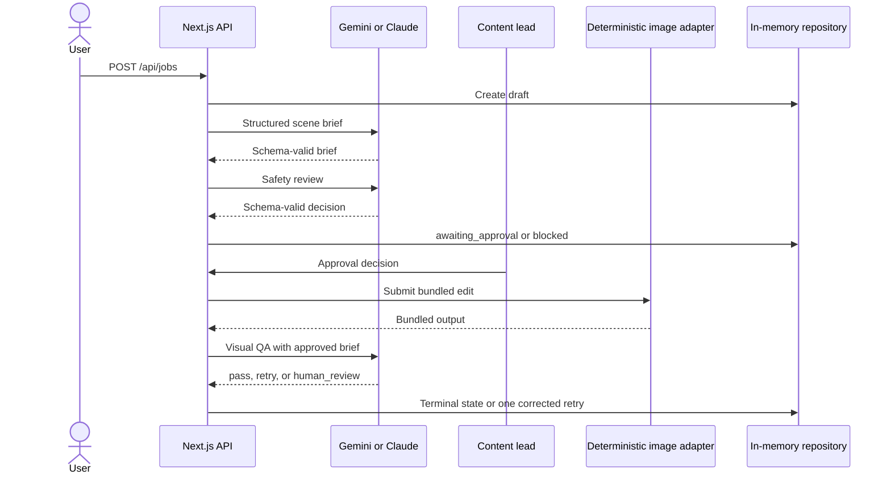
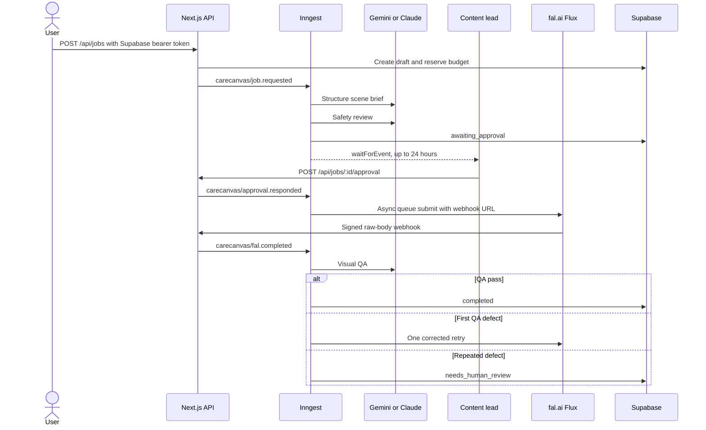

# Architecture

CareCanvas uses one provider-neutral pipeline contract across three deliberately different execution profiles. The profile controls which boundaries are real and which are deterministic; it does not change the domain state machine.

## Runtime profile matrix

| Boundary | `demo` | `harness` | `live` |
|---|---|---|---|
| Intelligence provider | Deterministic local adapter | Gemini or Anthropic API | Gemini or Anthropic API |
| Brief, safety, visual QA | Deterministic structured results | Real selected-provider calls | Real selected-provider calls |
| Image provider | Bundled deterministic adapter | Bundled deterministic adapter | fal.ai Flux Kontext or Flux Fill |
| Repository | Process-memory | Process-memory | Supabase Postgres |
| Orchestration | Synchronous request path | Synchronous request path | Durable Inngest events and waits |
| Authentication | Synthetic local actor | Synthetic local actor | Supabase bearer token |
| External spend | None | Intelligence calls only | Intelligence and image-provider calls |

The profile is selected with `CARECANVAS_MODE=demo|harness|live`. For `harness` and `live`, `CARECANVAS_INTELLIGENCE_PROVIDER=gemini|anthropic` selects the intelligence adapter and the matching server-only API key becomes mandatory. Demo mode always returns the local providers.

## Harness data flow

This profile is intentionally not a partial live deployment. It isolates the intelligence boundary so a real model can be evaluated without enabling fal webhooks, durable events, persistent user data, or image-provider spend.

The standalone `npm run harness:gemini` command invokes the Gemini provider directly with synthetic jobs and bundled images. It checks the brief, safety, and visual-QA contracts, plus a deterministic unsafe-request stop, then emits a machine-readable JSON report.

## Durable live data flow

## Intelligence-provider selection

Both providers implement the same narrow interface:

- `createBrief(job)` returns a refined prompt, visual intent, preserve list, and avoid list.
- `reviewSafety(job, brief)` returns `pass`, `block`, or `human_review` with explicit child-safety and medical-claim flags.
- `reviewImage(job, output, attempt)` returns `pass`, `retry`, or `human_review`, a score, checks, and an optional correction.

Gemini uses the Google Gen AI SDK's server-side API. Each model stage requests `application/json` with an explicit JSON schema, uses temperature zero, and then passes the decoded response through the existing Zod domain schema. The brief and safety stages receive only application data; visual QA receives the approved brief plus a bounded inline PNG. Visible instructions inside an image are treated as untrusted pixels.

Gemini adds the following fail-closed controls:

- deterministic blocking rules stop clearly high-risk or diagnostic requests before model spend;
- conflicting structured safety flags cannot be converted into a pass;
- a provider safety block becomes human review rather than silent approval;
- image inputs are limited to bundled/local application assets or approved `fal.media` HTTPS outputs and are rasterized within a bounded size;
- auth, quota, timeout, availability, contract, safety, and vision-input failures become sanitized stage errors;
- transport attempts are bounded, and model correction remains limited to one generation retry.

Anthropic remains a selectable implementation of the same brief, safety, and vision-QA contracts. Switching providers does not bypass the human gate, state-transition checks, budgets, or image retry limit.

## Trust boundaries

| Boundary | Invariant |
|---|---|
| Browser -> API | Zod parses every mutation. Live mode requires an authenticated Supabase actor. |
| Environment -> provider | Gemini, Anthropic, fal, service-role, and signing credentials remain server-only. |
| API -> agents | Each agent receives only the fields required for its bounded decision. |
| Model -> domain | Provider JSON must satisfy both its response schema and the CareCanvas Zod schema. |
| Approval -> image provider | `generating` is unreachable without an explicit approved event. |
| fal -> API | The raw body must pass Ed25519, timestamp, request-ID, and replay checks. |
| Storage -> user | A private object path starts with the authenticated user's UUID and is enforced by RLS. |
| Trace -> browser | Provider IDs are redacted; secrets and raw provider payloads are not retained. |

## Failure model

- Unsafe or medicalized direction stops at `blocked`, before image-provider spend and, for deterministic Gemini rules, before model spend.
- A missing human decision expires after 24 hours in durable live mode.
- Provider submission uses Inngest retries; model-directed image correction is separately bounded to one retry.
- A second visual-QA defect becomes `needs_human_review`; the model cannot loop indefinitely.
- Malformed model output fails schema validation and becomes a visible, sanitized failed trace.
- A malformed, stale, altered, or replayed fal webhook receives no workflow event.
- Demo mode replaces all external providers with deterministic adapters while exercising the same state machine.
- Harness mode replaces only the intelligence adapter; image output and persistence remain deterministic/local.

## Honest prototype boundaries

The Gemini integration is implemented but has not yet been exercised with a configured key in this workspace or public deployment. The default public deployment remains deterministic. fal.ai, Inngest, and Supabase remain the intended durable live stack and require the operator's own services, credentials, deployment, cost controls, and privacy review.

The repository includes a server-side usage guard. The SQL `usage_budget` table is the durable production target, and an atomic database function should replace the process-local counter before multi-instance production traffic. No claim is made that this prototype is clinically validated or production certified.
