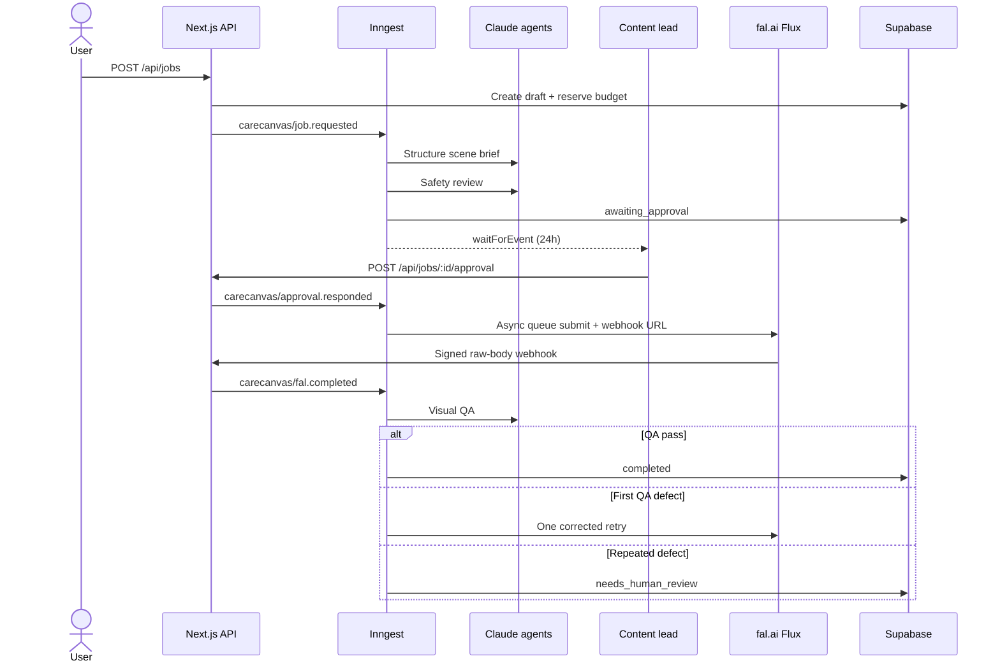

# Architecture

## Data flow

## Boundaries

| Boundary | Invariant |
|---|---|
| Browser → API | Zod parses every mutation. Live mode requires an authenticated Supabase actor. |
| API → agents | Each agent receives only the fields required for its bounded decision. |
| Approval → fal | `generating` is unreachable without an explicit approved event. |
| fal → API | The raw body must pass Ed25519, timestamp, request-ID, and replay checks. |
| Storage → user | A private object path starts with the authenticated user's UUID and is enforced by RLS. |
| Trace → browser | Provider IDs are redacted and no secret or raw provider payload is retained. |

## Failure model

- Unsafe or medicalized direction stops at `blocked`, before provider spend.
- A missing human decision expires after 24 hours.
- Provider submission uses Inngest retries; model correction is separately bounded to one retry.
- A second visual-QA defect becomes `needs_human_review`; the model cannot loop indefinitely.
- Malformed Claude output fails schema validation and becomes a visible failed trace.
- A malformed, stale, altered, or replayed fal webhook receives no workflow event.
- Demo mode replaces all external providers with deterministic adapters while exercising the same state machine.

## Honest prototype boundaries

The live adapters are implemented but require the operator's own services, credentials, deployment, and privacy review. The repository includes a server-side usage guard; the SQL `usage_budget` table is the durable production target, and an atomic database function should replace the process-local counter before multi-instance production traffic. No claim is made that this prototype is clinically validated or production certified.
